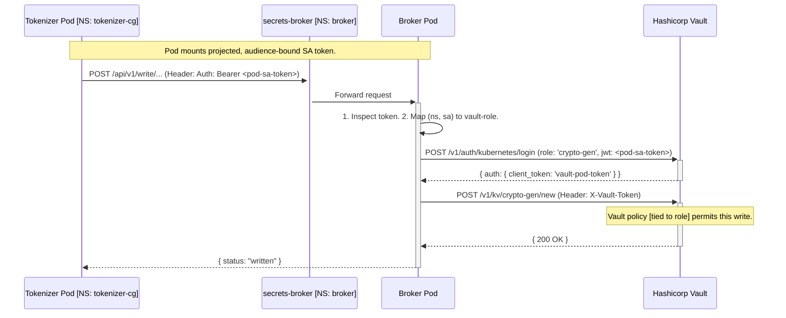
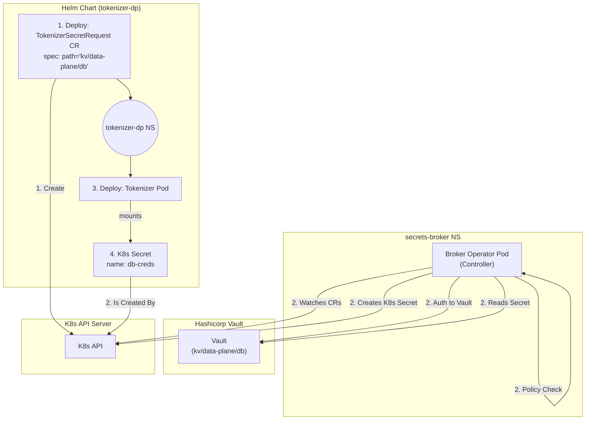
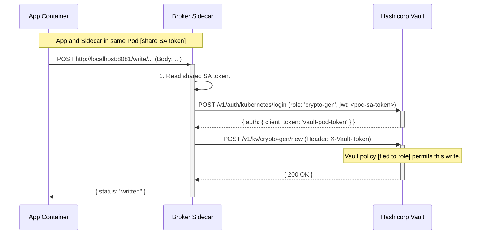

# ADR-001: Secrets Broker Service Architecture for Hashicorp Vault Integration

**Date:** 2025-11-14  
**Status:** Proposed (Updated)

## 1. Context

We are deploying a suite of microservices (TOKENIZER Control Plane, Data Plane, BFF, Crypto Gen, Config API) via separate Helm charts. These services require a secure and auditable mechanism to read and, in some cases, write secrets to a central Hashicorp Vault instance.

This ADR explores options for a "secrets-broker" service to facilitate this, acting as the single point of contact for all services. This broker must enforce security, map Kubernetes-native identities (ServiceAccounts) to Vault permissions, and be manageable within our Kubernetes environment.

### Key Requirements (Updated)

- **Secure Tenancy:** Isolate permissions. The TOKENIZER Data Plane must not be able to access TOKENIZER Control Plane secrets.
- **Mandatory Read/Write Operations:** The solution must support both read and write operations. Writing secrets (e.g., by TOKENIZER Crypto Gen Tool) is a non-negotiable requirement.
- **HTTP/S API Client:** All TOKENIZER services will be updated to communicate with the secrets-broker via an internal HTTP/S API.
- **K8s-Native:** Leverage Kubernetes constructs like Namespaces, ServiceAccounts (SAs), and RBAC.
- **Auditability:** All access to Vault should be auditable, ideally tied back to the original K8s service identity.
- **Centralized Policy:** The mapping of K8s identities to Vault permissions should be managed centrally.

## 2. Decision Drivers

- **Handling Writes:** (Critical) Securely managing write operations is a primary challenge and a mandatory requirement.
- **Security (Least Privilege):** The broker must not possess "god-mode" permissions. The access granted to a service should be the minimum required.
- **Application Impact:** (Resolved) The decision has been made to update all applications to use an HTTP/S API. This is no longer a blocker and is now a prerequisite implementation task.
- **Operational Overhead:** How complex is the solution to deploy, configure (both in K8s and Vault), and maintain?
- **Scalability & Performance:** The solution must not become a significant bottleneck. This includes both request latency and cluster resource consumption (CPU/Memory).

## 3. Considered Options

### Option 1: K8s Auth Passthrough Proxy (Centralized)

**Summary:** The secrets-broker acts as a smart, centralized proxy. It receives API requests from services, validates the service's identity, and then uses the service's own ServiceAccount token to authenticate to Vault via the Vault Kubernetes Auth Method. All permissions are enforced directly by Vault policies mapped to K8s SAs.

#### Architecture & Flow



#### Analysis

**Pros:**

- **Excellent Security:** The broker itself is not privileged in Vault. It only proxies auth. All permissions are enforced by Vault policies, which are mapped 1:1 with K8s ServiceAccounts. This is true "least privilege."
- **Handles Writes Perfectly:** (Meets Requirement) Write operations are secured by the same mechanism.
- **Auditable:** Vault audit logs will show the specific K8s SA (via the kubernetes auth method) that performed every action.
- **No Secret Storage in etcd:** Secrets are fetched "just-in-time".
- **Resource Efficient:** The proxy logic is centralized. A small number of broker pods (e.g., a 3-replica Deployment) can serve requests from hundreds of service pods.

**Cons:**

- **Performance:** Every secret request involves a K8s network hop (Pod -> Broker Service) plus the broker's API calls. This is acceptable for boot-time config but could be slow for frequent, "just-in-time" secret requests.
- **Complexity:** Requires configuration in three places: K8s (SA, NetworkPolicy), Vault (Auth, Roles, Policies), and the Broker (Policy Map).

### Option 2: CRD-based "Secret Sync" Operator (Read-Only)

**Summary:** The secrets-broker is a Kubernetes Operator. To get a secret, a service's Helm chart deploys a Custom Resource. The operator sees this CR, fetches the secret from Vault using its own privileged identity, and creates a native Kubernetes Secret.

#### Architecture & Flow



#### Analysis

**Pros:**

- **K8s-Native Workflow:** Managing access is done via K8s RBAC.

**Cons:**

- **Disqualified - Unsuitable for Writes:** (Blocker) This pattern is not designed for writing secrets. It does not meet the mandatory write requirement.
- **Disqualified - Misaligned with Client:** The decision to update all services to HTTP/S API clients makes this "pull" model (reading from K8s Secrets) obsolete.
- **Secrets Stored in etcd:** A significant security drawback.
- **Privileged Operator:** The operator requires broad permissions.

### Option 3: Sidecar Proxy (Decentralized)

**Summary:** A secrets-broker sidecar container is deployed alongside every TOKENIZER service container in the same pod. The main application container communicates with the sidecar via localhost. The sidecar uses the pod's shared ServiceAccount token to perform the same K8s Vault Auth flow as Option 1, but in a decentralized manner.

#### Architecture & Flow



#### Analysis

**Pros:**

- **Excellent Security:** Same "least privilege" model as Option 1.
- **Handles Writes Perfectly:** (Meets Requirement) Supports both read and write operations.
- **No Cluster Network Hops:** Communication from app to broker is over localhost, which is fast and secure.
- **Auditable:** Vault logs will still trace back to the K8s SA identity.

**Cons:**

- **Massive Resource Overhead:** (Blocker) This is the primary drawback. Every single service pod (e.g., 500 pods) would run its own copy of the broker sidecar. This results in a 500x multiplication of the CPU and Memory footprint for the secret-brokering logic, versus the 3-5 pods needed for a central service (Option 1).
- **Duplication of Effort / Maintenance:** Every Helm chart must be updated to include the sidecar definition. A bug fix in the sidecar image requires a rolling restart of every single service pod in the cluster.
- **High Connection Load on Vault:** Each sidecar authenticates and maintains its own token, resulting in N (number of pods) distinct login events and active client tokens, which places a high load on Vault. Option 1 can more easily cache and multiplex these.

## 4. Decision

**Option 1 (K8s Auth Passthrough Proxy) remains the only viable solution.**

The new requirements (mandatory read/write, HTTP/S clients) have clarified the decision:

- **Option 2 is Disqualified:** It fails the mandatory write requirement and is misaligned with the new HTTP/S client architecture.
- **Option 3 is Disqualified:** While it is functionally viable and secure, the operational and resource cost is prohibitive. The massive duplication of resources (CPU/Memory) and maintenance effort (rolling out sidecar updates) across all pods makes it an inefficient and unscalable solution compared to a centralized proxy.
- **Option 1 is the Clear Winner:** It is the only solution that meets all requirements (read/write, least-privilege, auditability) while also being highly resource-efficient and centrally manageable. The one-time cost of updating applications to use an API is accepted, and the cost of a single cluster network hop is a minor and acceptable trade-off for the enormous gains in scalability and operational simplicity.

The application-level changes are an accepted one-time engineering cost that provides a long-term, secure, and scalable foundation for all service-to-secret interactions.

## 5. Implementation Details (for Option 1)

### A. K8s/Helm Chart Responsibilities

#### secrets-broker Chart

- Deploys the Broker Deployment, Service (ClusterIP), and ServiceAccount.
- Deploys NetworkPolicy to allow Ingress from namespaces with a label (e.g., `tokenizer-service: "true"`) on the broker's port.
- Deploys a ConfigMap for the broker's policy: `(ns, sa) -> vault-role`.

**broker-policy-configmap.yaml:**

```yaml
policy:
  - k8s_ns: "tokenizer-dp"
    k8s_sa: "tokenizer-dp-sa"
    vault_role: "tokenizer-dp-role"
  - k8s_ns: "tokenizer-cg"
    k8s_sa: "tokenizer-cg-sa"
    vault_role: "tokenizer-cg-role"
```

#### TOKENIZER-* Charts

- Must create a unique ServiceAccount (e.g., `tokenizer-dp-sa`).
- **Deployment:** Must set `serviceAccountName: tokenizer-dp-sa`.
- **Deployment:** Must mount a projected service account token:

**deployment.yaml:**

```yaml
volumes:
  - name: vault-sa-token
    projected:
      sources:
        - serviceAccountToken:
            path: token
            audience: "secrets-broker" # Binds the token for use only by the broker
            expirationSeconds: 3600
...
containers:
  - name: my-app
    volumeMounts:
      - name: vault-sa-token
        mountPath: "/var/run/secrets/broker-token"
        readOnly: true
```

- **Deployment:** Must inject the broker URL and token path as env vars:

**deployment.yaml:**

```yaml
env:
  - name: SECRETS_BROKER_URL
    value: "http://secrets-broker.secrets-broker.svc.cluster.local:8080"
  - name: SECRETS_BROKER_TOKEN_PATH
    value: "/var/run/secrets/broker-token/token"
```

### B. Vault Administrator Responsibilities

#### Enable K8s Auth

```bash
# (One-time setup)
vault auth enable kubernetes
vault write auth/kubernetes/config \
    kubernetes_host="https://$KUBERNETES_SERVICE_HOST:$KUBERNETES_SERVICE_PORT" \
    kubernetes_ca_cert=@/var/run/secrets/kubernetes.io/serviceaccount/ca.crt \
    ...
```

#### Create Vault Policies

**policy-tokenizer-dp.hcl:**

```hcl
path "kv/data/tokenizer/data-plane/*" {
  capabilities = ["read"]
}
```

**policy-tokenizer-cg.hcl:**

```hcl
path "kv/data/tokenizer/crypto-gen/*" {
  capabilities = ["read", "write", "list"]
}
```

#### Create Vault K8s Auth Roles

(This binds K8s SA to Vault Policy)

**Role for Data Plane (read-only):**

```bash
vault write auth/kubernetes/role/tokenizer-dp-role \
    bound_service_account_names="tokenizer-dp-sa" \
    bound_service_account_namespaces="tokenizer-dp" \
    policies="default,policy-tokenizer-dp" \
    token_ttl="1h"
```

**Role for Crypto Gen (read-write):**

```bash
vault write auth/kubernetes/role/tokenizer-cg-role \
    bound_service_account_names="tokenizer-cg-sa" \
    bound_service_account_namespaces="tokenizer-cg" \
    policies="default,policy-tokenizer-cg" \
    token_ttl="1h"
```
